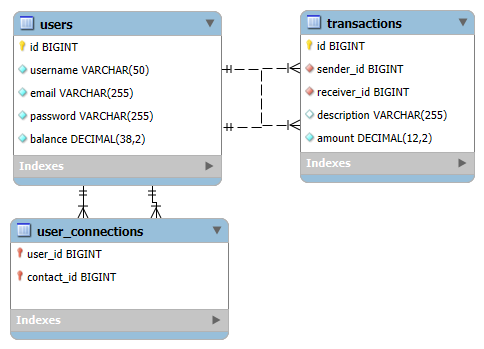

# paymybuddy

# Modèle Physique de Données

## Tables

### Table `users`
- id : BIGINT, clé primaire, auto-incrémentée, NOT NULL
- username : VARCHAR(50), UNIQUE, NOT NULL
- email : VARCHAR(255), UNIQUE, NOT NULL
- password : VARCHAR(255), NOT NULL

### Table `transactions`
- id : BIGINT, clé primaire, auto-incrémentée, NOT NULL
- sender_id : BIGINT, clé étrangère vers users(id), NOT NULL
- receiver_id : BIGINT, clé étrangère vers users(id), NOT NULL
- description : VARCHAR(255), optionnel
- amount : DECIMAL(12,2), NOT NULL

### Table `user_connections`
- user_id : BIGINT, clé étrangère vers users(id), NOT NULL
- contact_id : BIGINT, clé étrangère vers users(id), NOT NULL
- clé primaire composée : (user_id, contact_id)

## Diagramme

